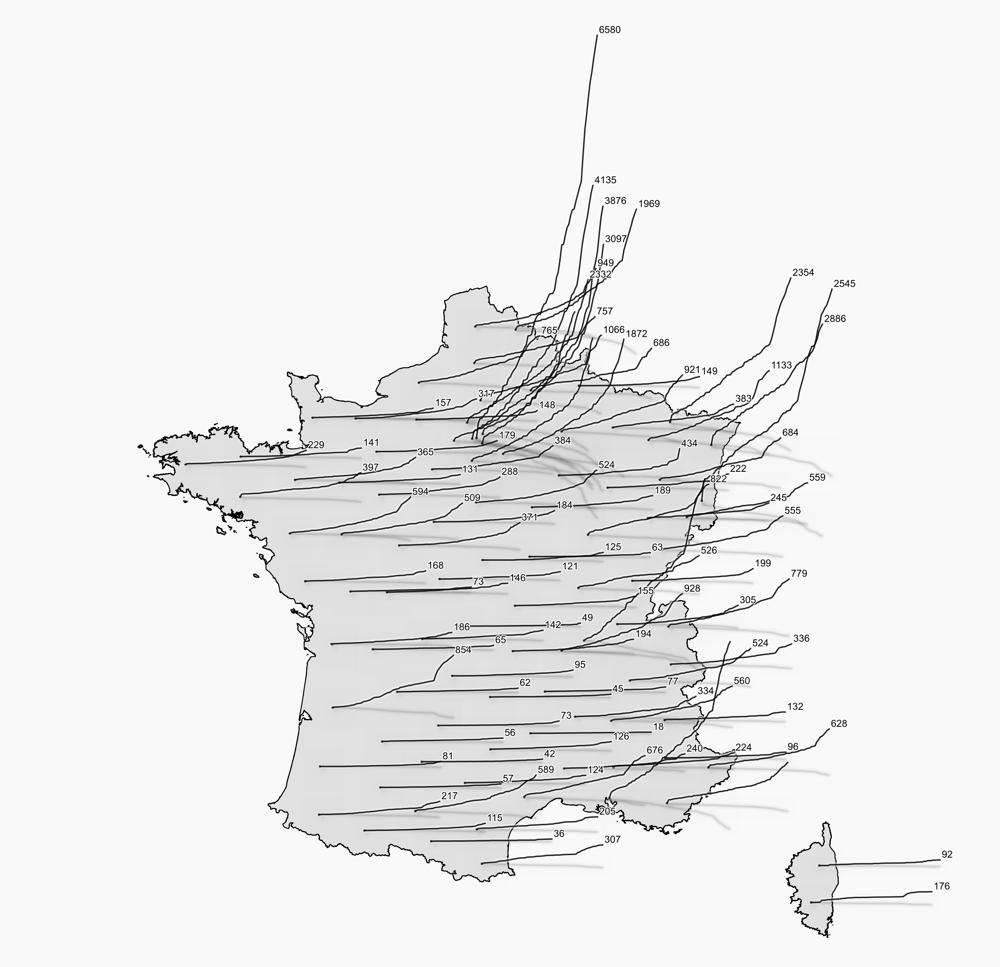
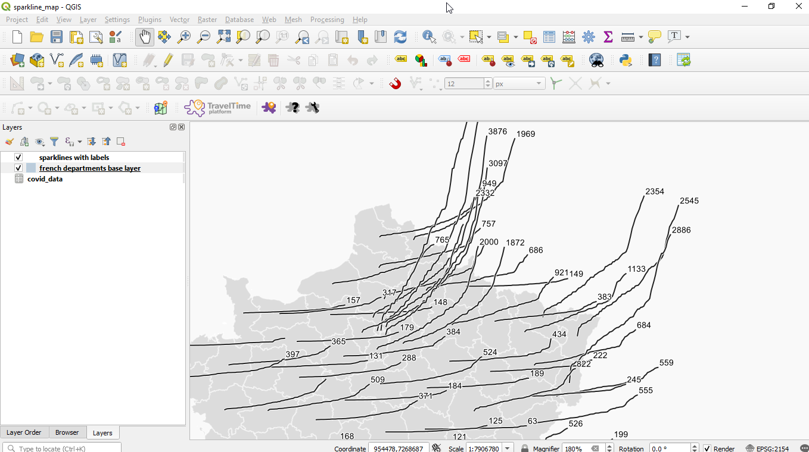

# COVID-19 Sparkline Map

## Steps
[Download QGIS](https://www.qgis.org/fr/site/forusers/download.html)

I used version `3.12`

Open project `sparkline_map.qgz`

You'll have this :

That's it ! Now, play with styling, parameters

## Data
- [French Boundaries from IGN](https://www.data.gouv.fr/fr/datasets/admin-express/)
- [Covid-19 cases from Santé Publique France](https://www.data.gouv.fr/fr/datasets/donnees-hospitalieres-relatives-a-lepidemie-de-covid-19/)

## Expression
We use this expression for the line geometry :

	with_variable(
	'height',
	-- Height factor for each segment. Total height will be nb cases * @height
	100,
	with_variable(
	-- Width of the line, starting from centroid
	'width',
	200000,
	with_variable(
	'nb_cases',
	array_sort(
		relation_aggregate( 
			-- Relation name 
			'covid_data_dep_french_dep_INSEE_DEP',
			-- Compile in an array
			'array_agg', 
			-- Calculate number of cases
			to_int("dc")+to_int("hosp")+to_int("rea")+to_int("rad")
		)
	 ),
	 -- Create geometry
	geom_from_wkt(
		-- Create WKT String
		'LINESTRING ('  || 
		-- First node is the centroid
		x(centroid($geometry))||' '||y(centroid($geometry)) ||','||
		-- Paste the node coordinates
		array_to_string(
			-- Iterate over indexes
			array_foreach(
				-- Generate a series over the indexes / nodes
				generate_series(1, array_length(@nb_cases)), 
				-- X Coordinate of the node
				to_string(x(centroid($geometry)) + (@element/array_length(@nb_cases)*@width)) ||' '||
				-- Y coordinate of the node
				to_string(y(centroid($geometry)) + @nb_cases[@element]*@height)
			),
		',') || ')'
	)
	)))

Also, the labels are positioned using the same kind of expression.

## Links
[See my blog post for an explanation of the expression code](https://datagistips.hypotheses.org/488)

## Map image licence
CC BY SA NC

